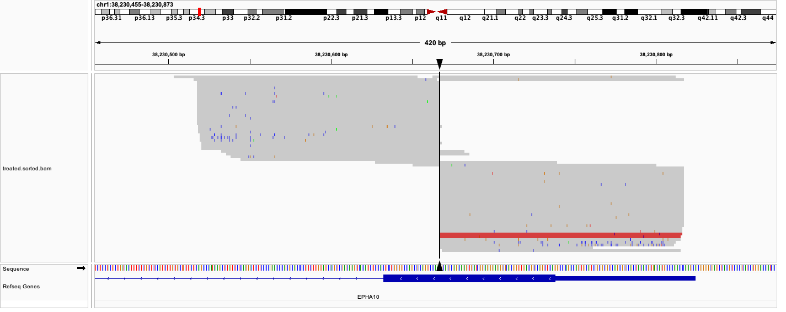
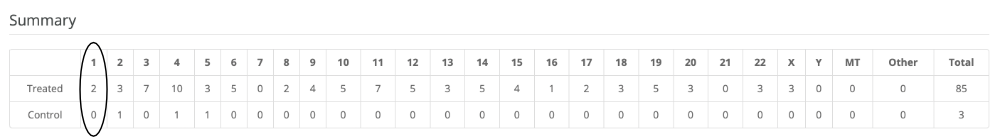
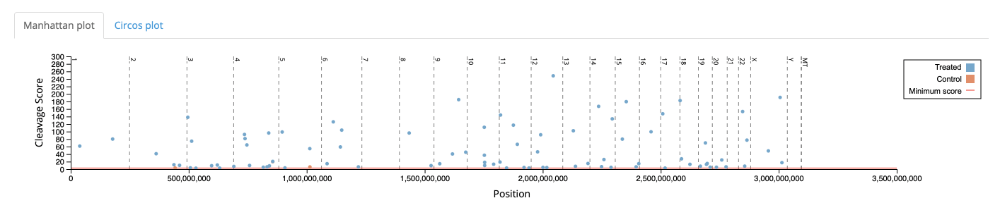
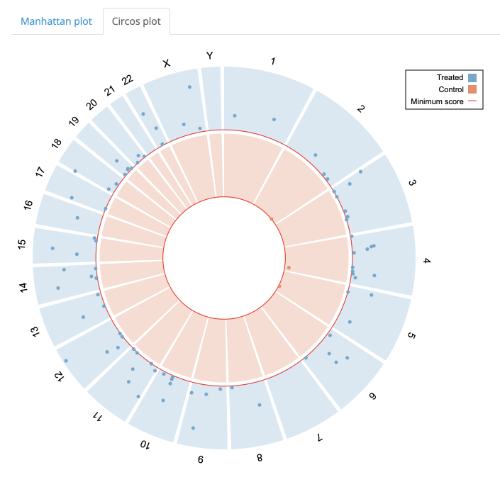
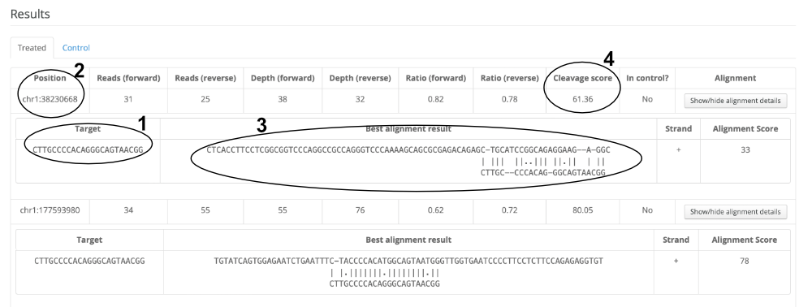

# オフターゲット効果の評価解析手法　「Digenome-seq」　＆ データ解析　web tool 
## Digenome-seq ([doi:10.1038/nmeth.3284], [doi:10.1038/s41596-020-00453-6])
[doi:10.1038/nmeth.3284]:https://doi.org/10.1038/nmeth.3284
[doi:10.1038/s41596-020-00453-6]:https://doi.org/10.1038/s41596-020-00453-6  
  CRISPR RNA-guided nucleases や deaminases によるゲノム編集時のオフターゲット効果を評価する。  
***
  ### 背景  
  target配列を認識するguide RNA の配列が数塩基のミスマッチを許容することがあるため、off-tagetが発生する。off-targetを評価する解析手法が必要  
***
  ### コンセプト  
  * ターゲットサイト標的に設計した Cas9 を使い in vitro で (培養細胞から抽出したゲノムDNAに) DNA dobule strand breaks (DSB) を誘導(off-target site も切断)  
  * 処理されたゲノムDNAをフラグメント化し、WGS を実施  
  * DSB 誘導後、DSB修復が起きていない -> Cas9 で切断されたサイト(off-target site)がシーケンスされると5'末端が同一のリードが得られる　(viewer でマッピング結果を可視化すると垂直断面が確認される(下図))  
    
  * 5'末端が同一ポジションのリードを用いて解析  
  * 上記リードからDNA cleavage score を計算 -> 評価基準に採用 (同一末端のリード数が多い場合に高 score となり、Cas9による切断と判断. 計算式は [web](http://www.rgenome.net/digenome-js/help#example) を参照)  
 ***  
  ### データ解析 [web_tool]
  [web_tool]:http://www.rgenome.net/digenome-js/#!  
  * example data を使用してのtest run  
    web tool site の an example data のリンクからテスト用のBAM file("WT BAM" & "Cas9 treated BAM") をDL  
     
    (i) Sequencing Data　のロード  
      
        - Nuclease-treated BAM file & control BAM file をロード  
        * DL したBAM file をロード
        - カラムからrefernce genome を選択（ensemblに対応）  
        * Human (GRCh37) を選択  
          
    (ii) Nuclease Information を設定  
      
        - DNA切断タイプをカラムから選択  
        * Blun end を選択(テストデータ用)  
        - ターゲット配列を記入  
        * 5'-CTTGCCCCACAGGGCAGTAACGG-3' (テストデータ用ターゲット配列)  

          
    (iii) Filtering Options を設定  

        - Minimum mapping quality for bam reads (default 1)  
        - Minimum number of forward reads with same 5' ends (default 5), forward read の 5'末端が一致しているリード数  
        - Minimum number of reverse reads with same 3' ends (default 5), reverse read の 3'末端が一致しているリード数  
        - Minimum depth at each position (default 10), ターゲットサイトのmapping depth 
        - Minimum ratio at each position (default 0.2), (= number of F read w/ same 5' or number of R read w/ same 3' / depth at position) 
        - Minimum cleavage score (default 2.5, recommended)  
          
        default 設定で実行
          
    (iv) 実行 Run digenome-seq  
      
        - Summary表示にて各染色体ごとにoff-target site候補数を確認できる  
    
          Cas9処理サンプルでは off-target 候補 site はトータル85ヶ所  
          Cas9処理サンプルでは chr1 に off-target site の候補が2ヶ所  
            
        - ManhattanプロットやCircosプロットにて視覚化  
     
      
        - Result にて詳細を確認  
      
  
        * 1 Target: ターゲット配列(テスト用：CTTGCCCCACAGGGCAGTAACGG)  
        * 2 Position: off-target 候補 site の位置  
        * 3 Best alignment result: アライメント結果  
        * 4 Cleavage score: DNA cleavage score の計算結果 (推奨値:2.5, 超えるとpositive)  
  
  